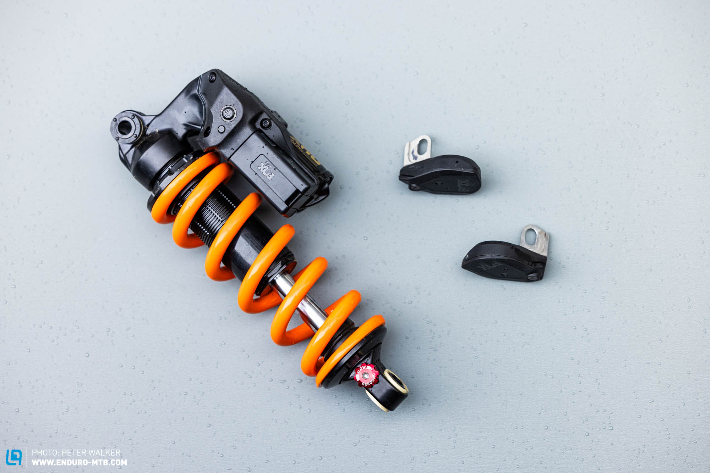
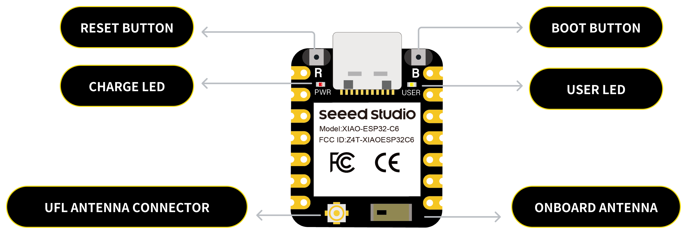
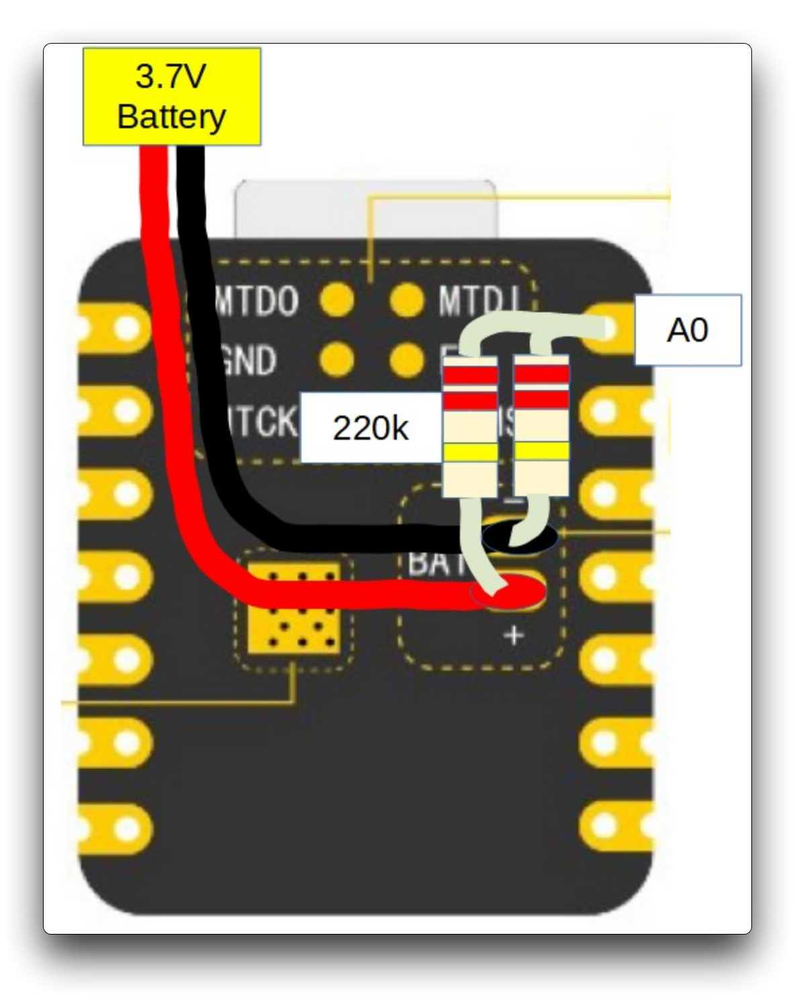

# Data Logger and Sensor Package with ESP32C6, ESP-NOW

**Data Logger, ESP-NOW, DataViz Webserver, LSM330DHC**

Future Work: Power Management, Data handling for 500Hz+ logging, GPS Integration, "Fun" metrics

## Table of Contents

 - [Introduction](#introduction)
 - [Schematics](#schematics)
 - [Code Functionality](#Code-Functionality)
 - [Work to be Done](#Work-to-be-Done)
 - [References and Cool Information](#References-and-Cool-Information)

## Introduction
// Write a short sentence or two about this project and what it does. Be sure to include a link and a screenshot (we're front end devs so we can actually see our work!).

An open sourced data logger to determine the acceleration data at the axle of a bike, primarily used for ride optimization for mountain biking, however could be the basis for any sort of data acquisition system. The initial idea and form factor for this system came from disbelief of the Fox "Live Valve NEO" system, and an initial mis-understanding of how the NEO system performed. (Below image is LiveValve Neo, NOT MY DATA LOGGER)

In the world of mountain biking (or any wheeled, speed based sport), the optimization of forces at the contact patch between the ground and your wheel has been the golden rule amongst all improvements, and controlling these forces yada yada yada I want to better understand the acceleration of my front and rear wheel in order to improve (or more likely pretend to improve) the setup of the front and rear shocks on my bike. Hopefully this will lead to better handling characteristics of the bike, but at the very least will be a fun project to dip my toe into coding, electronics, data analysis, and mountain biking. 

Generally, shock potentiometers are used to track shock position as they go through their travel and then is turned into velocity for analysis, however these are expensive sensors to use to get started with electronics. So instead, this system will take accelerometer data at the axle of the front and rear wheel to determine the shock velocities, as well as providing some additional information such as steer or lean angle that could be used in the future. This accelerometer data will be sent wirelessly to a central data logger, where the information will be stored on an SD card, along with being hosted on a webserver that can be accessed from another device on the same network, such as a phone or laptop. 

For a little bit more detail, the peripheral sensor nodes (naming convention still in progress) will be mounted to the front and rear brake caliper mounts, and will be based on Seeed Studio XIAO ESP32C6 boards wired through SPI to Adafruit LSM330DHC accelerometers, powered by a small rechargeable	 LiPo battery. These peripheral sensors will communicate to the central node (again, naming is WIP) through ESP-NOW, a wifi based communication protocol specifically between ESP chips. The ESP32C6 board has an integrated antenna along with a built-in power management chip, reducing the overall effort to get to a Minimum Viable Product (MVP), or at the very least something to play with. 

The central node will be wired through SPI to an SD card reader to store all of the logged data. This central node will also handle any data analysis shown on the hosted webserver. 

## Schematics

**Tech used:** Arduino IDE, ESP32C6, ESP-NOW, XIAO ESP32C6

### Peripheral Sensor Node

**ESP32C6 Overview

**ESP32C6 Pins

For SPI connection between the accelerometer and the ESP32, there are already hardware SPI pins allocated: 
SCK: 8
MISO: 9
MOSI: 10

For the CS pin, any pin can be used, however we will use pin 3
CS: 3

For the connections to the accelerometer, it is as follows (Accel to Xiao, schematic to be added)
Vin: 5V or 3V (we will use 3V3)
GND: GND
SCL: D8
DO: D9
SDA: 10
CS: 3

Because I didn't have this memorized: 
SCK = SCL
D0 = MOSI
SDA = MISO
CS = CS or SS

** Battery Management

For power management, We will follow from the XIAO tutorial to wire the battery to the board, and connect the voltage splitter to analog pin A0 for reading. 

### Controller Node

This will be filled with something at some point. A lot of the wiring is similar to the above, except SPI to SD card reader, potentially different controller, similar battery management system. 

## Code Functionality

This section is to break down what each section of code does. Mostly Random Nerd Tutorials work, but with this specific application (thank you again)

## Optimizations
*(optional)*

You don't have to include this section but interviewers *love* that you can not only deliver a final product that looks great but also functions efficiently. Did you write something then refactor it later and the result was 5x faster than the original implementation? Did you cache your assets? Things that you write in this section are **GREAT** to bring up in interviews and you can use this section as reference when studying for technical interviews!

## Lessons Learned:

No matter what your experience level, being an engineer means continuously learning. Every time you build something you always have those *whoa this is awesome* or *wow I actually did it!* moments. This is where you should share those moments! Recruiters and interviewers love to see that you're self-aware and passionate about growing.

## References and Cool Information

HUGE thanks to Random Nerd Tutorials, without their guides I'd be hopeless
https://RandomNerdTutorials.com/esp32-esp-now-wi-fi-web-server/

XIAO ESP32C6
https://wiki.seeedstudio.com/xiao_esp32c6_getting_started/

Adafruit LSMDSOX
https://learn.adafruit.com/lsm6dsox-and-ism330dhc-6-dof-imu/arduino

How to write a wicked README.md
https://github.com/BegoonLab/xiao-esp32c6-wifi-sensor